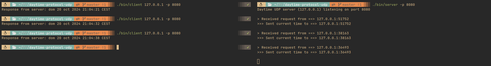

# Daytime Protocol UDP
Customs implementation of the daytime protocol using UDP transport protocol [(RFC 867)](https://datatracker.ietf.org/doc/html/rfc867) by Jon Postel

A `server` listens for `UDP datagrams` on UDP port 13.  When a datagram is received, an answering datagram is sent containing the current date and time as a ASCII character string (the data in the received datagram is ignored).

Example of output:
```
Thursday, February 2, 2006, 13:45:51-PST
```



## Server
Iterative UDP server, only serves one request at time. Daytime is obtained by `$date` command.  
When a datagram is received (data in the datagram is ignored) => Anwers with a datagram with the current daytime as ASCII character string.

### Execution
```
$./bin/server [-p port]
```
If no port is specified it will get the default by the system to the daytime protocol.

#### Output
```
Daytime UDP server (localhost) listening on $port 
```
Prints in the console the addrs that solicitate the service.
```
> Received request from ==> ip_addr:port_addr
>>> Sent current time to ==> ip_addr:port_addr
```

### Stop
Kill the process
```
Keybiding: Ctrl+C
```

## Client
Normal UDP client that send a datagram (data information is not relevant) to the `daytime` server and the received data is printed in the console.

### Execution
```
$./bin/client server_addr [-p server_port]
```

### Output
The output have no specific syntax.
```
 Response from server: Tuesday, February 22, 1982 17:37:43-PST
```

## Build & Debug & Clean binaries
`Makefile` file contains the necessary commands to build the project binaries files will fall under `bin/` directory
```
$make all
```
`make clean` to remove the binaries  
`make debug` to build the binaries to debug them with gdb
